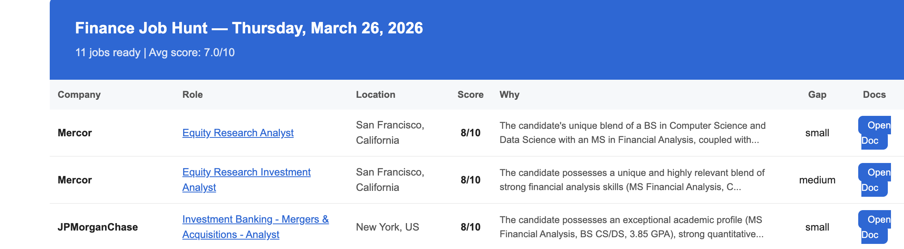

# Finance Job Application Agent

> Every weekday at 7 AM, this pipeline searches finance job boards across the US and Ireland, scores each role against my profile, and — for every job scoring 7/10 or above — rewrites my resume, writes a personalised cover letter, runs a skill gap analysis, saves everything to Google Drive, logs it to a tracker, and sends me a summary email. All before I wake up.

---

## How It Works

### Pipeline Steps

| Step | Tool | What it does |
|------|------|-------------|
| **Trigger** | n8n Scheduler | Fires every weekday at 7:00 AM |
| **Fetch Jobs** | Adzuna Jobs API | Runs 6 targeted searches across US + Ireland |
| **Deduplicate** | Google Sheets | Checks seen-jobs log, skips already-processed listings |
| **Score** | Gemini 2.5 Flash | Rates each job out of 10 across 5 dimensions |
| **Filter** | n8n IF node | Routes jobs scoring ≥7 to generation pipeline |
| **Resume Rewrite** | Gemini 2.5 Flash | Tailors resume with ATS-optimised keywords for the role |
| **Cover Letter** | Gemini 2.5 Flash | Writes a personalised cover letter based on JD + profile |
| **Skill Gap** | Gemini 2.5 Flash | Identifies gaps between my profile and the role requirements |
| **Save to Drive** | Google Docs API | Creates individual Docs for each output |
| **Log to Tracker** | Google Sheets API | Appends company, role, score, location, gap rating, doc links |
| **Email Summary** | Gmail API | Sends formatted HTML digest with all matches |

---

## Scoring Dimensions

Gemini evaluates each job across 5 dimensions:

- **Role match** — Does the job title and function align with target roles?
- **Level match** — Is the seniority appropriate (entry/analyst level)?
- **Skills match** — How much of the JD matches the candidate's technical skills?
- **Location match** — Is the role in a target geography or remote-friendly?
- **Entry friendliness** — Is it realistic for a recent graduate to be competitive?

Jobs scoring **7/10 or above** trigger the full document generation pipeline.

---

## Sample Output

*Daily email digest — 11 jobs found, avg score 7.0/10. JPMorgan M&A and Mercor Equity Research both scored 8/10.*

---

## Stack

- **Orchestration:** [n8n](https://n8n.io) (self-hosted workflow automation)
- **AI:** Google Gemini 2.5 Flash (scoring, generation, gap analysis)
- **Job Data:** [Adzuna Jobs API](https://developer.adzuna.com/)
- **Storage:** Google Drive, Google Docs, Google Sheets
- **Notifications:** Gmail API
- **Deduplication:** Google Sheets (seen-jobs log)
- **Webhook:** n8n webhook endpoint for real-time tracker updates

---

## Why I Built This

Job searching in finance is repetitive and time-consuming — reading JDs, tailoring CVs, writing cover letters. The bottleneck isn't judgment; it's volume. This pipeline handles the volume so I can focus on preparation and interviews.

The hardest part wasn't the code — it was defining what **"good fit"** means precisely enough that an LLM can score it consistently. Vague prompts produce vague scores. Specific rubrics with weighted dimensions produce actionable outputs.

---

## About Me

MS Financial Analysis, Temple University (GPA 3.85) · CFA Level 2 Candidate · BS Computer Science, UCD Dublin

- [LinkedIn](https://linkedin.com/in/kabir-guglani)
- [GitHub](https://github.com/kabirguglani)
- [Credit Risk Model](https://github.com/kabirguglani/credit-risk-model)
- [Factor Portfolio](https://github.com/kabirguglani/factor-portfolio)
- [AI Tone Bias Research](https://github.com/kabirguglani/ai-tone-bias)

---

*Built March 2026*
